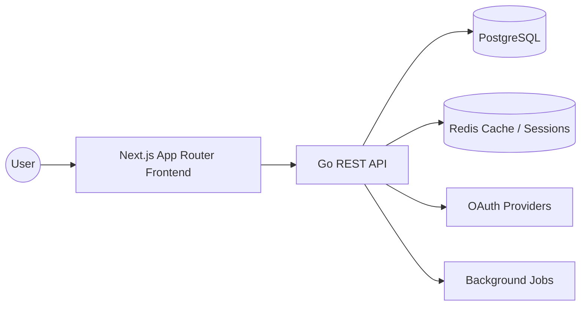

# System Architecture

## 1. Architecture Overview



The frontend handles rendering, route protection, form validation, and API orchestration through React Query. The backend exposes versioned REST APIs, keeps business logic in services, and isolates data access in repositories. PostgreSQL stores durable application data, Redis handles caching and session-related use cases, and the auth boundary supports JWT access/refresh tokens plus future OAuth providers.

## 2. Database Design

Core tables:

- `users`: identity, email, hashed password, role, status, timestamps.
- `refresh_tokens`: token rotation, device metadata, expiry, revocation.
- `oauth_accounts`: provider linkage for Google/GitHub/etc.
- `sessions`: optional persistent session tracking for web clients.
- `audit_logs`: security-sensitive actions, auth events, and admin operations.

Relationship rules:

- A user can own many refresh tokens.
- A user can have many OAuth accounts.
- Refresh tokens should be hashed at rest.
- Email and provider identifiers should be unique and indexed.

Suggested indexes:

- `users(email)` unique index
- `users(role)` index
- `refresh_tokens(user_id, revoked_at, expires_at)` composite index
- `oauth_accounts(provider, provider_user_id)` unique composite index

## 3. Backend Folder Structure

```text
backend/
  cmd/api/                # Application entrypoint
  internal/
    config/               # Environment and app settings
    handlers/             # HTTP handlers and request/response DTOs
    middleware/           # Logging, recovery, auth, rate limiting
    models/               # Domain and persistence models
    routes/                # Route registration and versioning
    services/             # Business logic and orchestration
    repository/           # Data access interfaces and implementations
    database/
      postgres/           # PostgreSQL connection and query helpers
      mysql/              # Optional MySQL adapter if required later
      migrations/         # SQL migration files
      seeds/               # Seed data for local environments
```

## 4. Frontend Folder Structure

```text
frontend/
  app/                    # App Router routes, layouts, and providers
  components/
    ui/                   # Reusable primitives
    layout/               # Navigation, footer, shell
    forms/                # Form compositions
    features/             # Feature-specific UI blocks
  context/                # React contexts and global state
  hooks/                  # Reusable hooks
  services/               # API clients and domain services
  lib/                    # Shared helpers
  types/                  # Shared TypeScript types
  public/                 # Static assets
```

## 5. Development Roadmap

1. Establish the frontend shell, design tokens, and route groups.
2. Implement auth flows with React Query, Zod, secure cookies, and protected routes.
3. Build the backend authentication service, JWT issuance, refresh token rotation, and role checks.
4. Add PostgreSQL migrations, repository implementations, and data validation.
5. Introduce Redis caching, structured logging, and rate limiting.
6. Expand API coverage, integration tests, and frontend component tests.
7. Containerize the stack and add CI/CD pipelines.
8. Prepare deployment manifests and production observability.